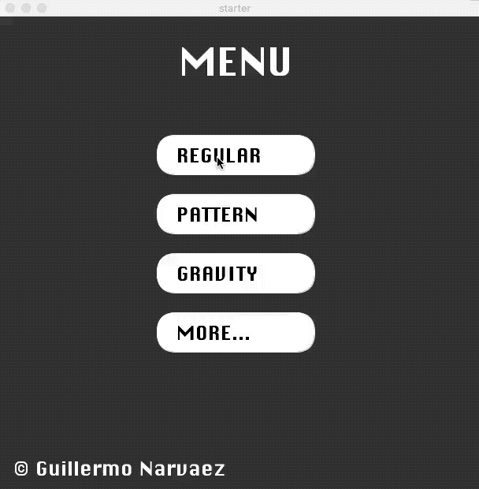
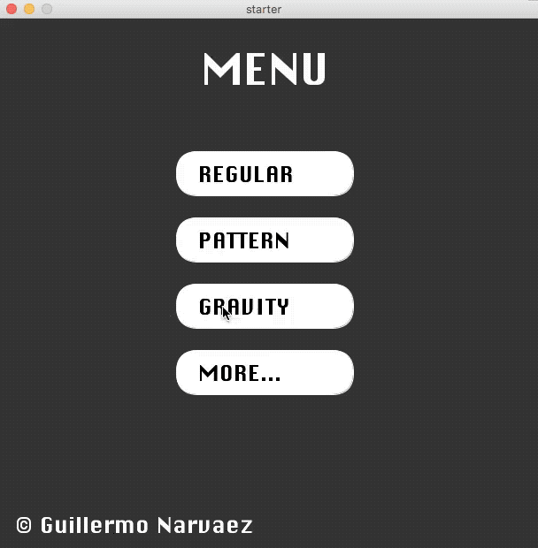

# Pong Game

My own version of the game of Pong implemented in Java through the Processing platform. The game includes a normal mode, a gravity mode, and a random pattern mode.

## Installation

Download the folder that corresponds to your operating system and open the Pong application or executable. The macosx application has Java embedded, but every other operating system should have installed Java 8.

To download the latest Java go to:

```
https://java.com/en/download/
```

## Game Design


### Regular Mode



### Random Pattern Mode


### Gravity Mode


